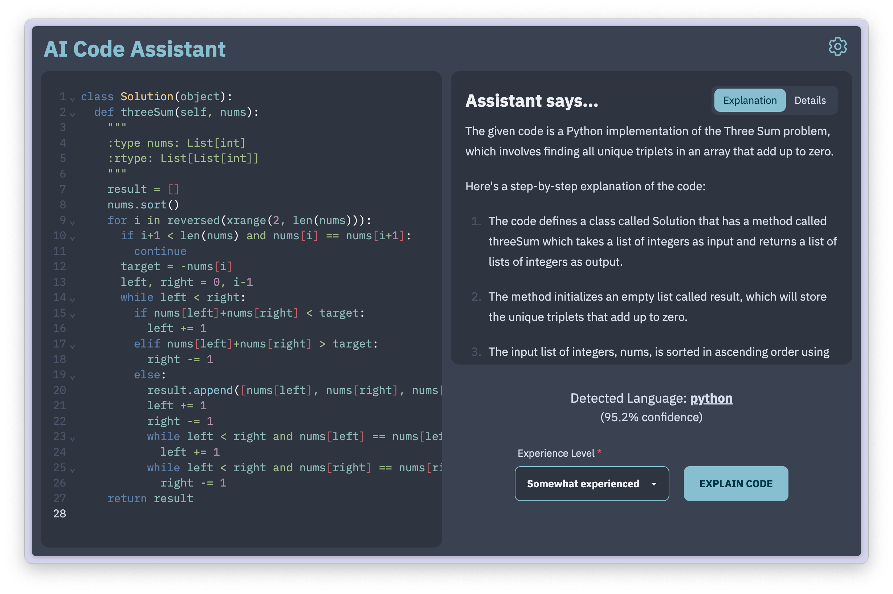

# AI Code Assistant

A ChatGPT tool for explaining code. [Link to deployed app.](https://code-assistant.dlazaro.ca/)

You will need an OpenAI API key in order to use this app. [Find out more.](https://platform.openai.com/docs/api-reference/authentication)

## Features

- Lightweight code editor from [CodeMirror](https://codemirror.net/)
  - Automatic language recognition using [vscode-languagedetection](https://github.com/microsoft/vscode-languagedetection)
  - Syntax highlighting with [Nord colourscheme](https://www.nordtheme.com/)
- Fully responsive design
- Code explanations powered by ChatGPT (`gpt-4o-mini`)
  - Takes your experience level into account
- Provides extra details, such as...
  - Model's confidence in the explanation
  - Assumptions made by the model
  - Additional resources to learn more about the code topic
